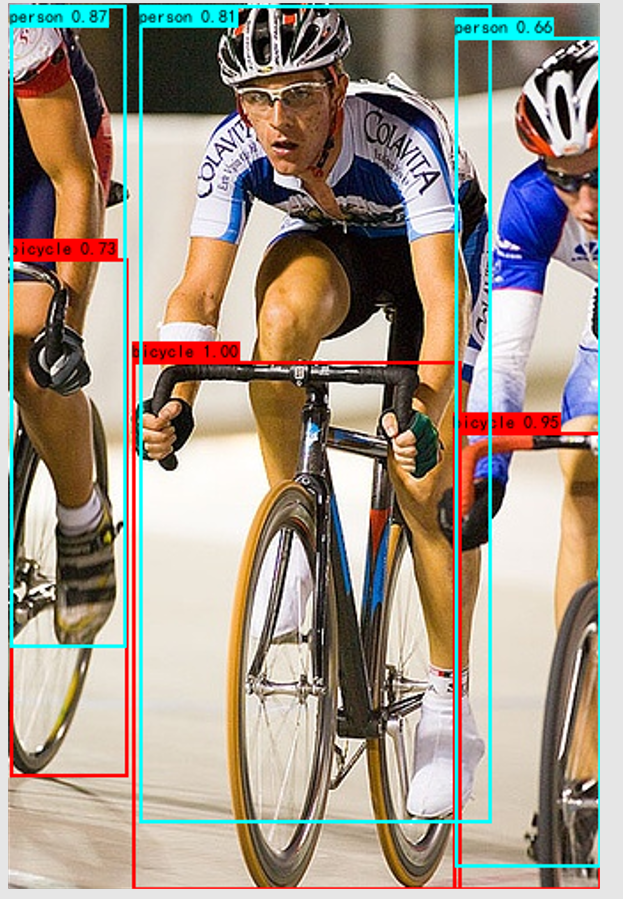

# 深度学习图像处理常用脚本

## 根据已知的边界框坐标与类别绘制边界框

- 可用于数据预处理后的单元检测
- 可用于预测时对输入的一张图像进行画框
- 参数设置可以打开脚本阅读函数说明

```python
def test_demo():
    index_to_label = {0: "bicycle", 1: "person"}
    img = cv2.imread("test.jpg")
    box_coords = torch.tensor(
        [
            [70, 202, 255, 500],
            [251, 242, 334, 500],
            [1, 144, 67, 436],
            [1, 1, 66, 363],
            [74, 1, 272, 462],
            [252, 19, 334, 487],
        ]
    )
    box_labels = torch.tensor([0, 0, 0, 1, 1, 1])
    box_scores = torch.tensor([1, 0.95, 0.73, 0.87, 0.81, 0.66])
    drawOnePictureWithBox(
        index_to_label,
        img,
        box_coords,
        box_labels,
        box_scores,
        resize_scale=300,
        is_use_scores=True,
        is_ralative_coords=False,
    )
```



## 制作并读取目标检测数据集通用标签

- MakeTextAnnotations：对 python 从数据集格式中获取的信息进行统一标签制作，构成统一的标签格式 txt_annotations.txt 供 ReadTextAnnotations 脚本读取
- ReadTextAnnotations：读取 txt_annotations.txt 中统一标签格式并返回对应边界框信息

## 优化目标函数

- DIOU Loss
- Label Smoothing Loss

## 获取多个边界框与多个边界框之间的 IOU 矩阵：iouMatrx 脚本

